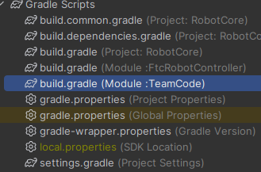

# Installation process

1. This is the TeamCode build.gradle, (**in blue above**)
you need to add the two lines mentioned as `IMPORTANT`
```gradle
    // TeamCode/build.gradle
    
    apply from: '../build.common.gradle'
    apply from: '../build.dependencies.gradle'

    android {
        namespace = 'org.firstinspires.ftc.teamcode'
        
        packagingOptions {
            jniLibs.useLegacyPackaging true
        }
    }
    repositories {
        // IMPORTANT
        maven { url 'https://repo.dairy.foundation/releases' }
        // (thanks to dairy for hosting!)

    }

    dependencies {
        implementation project(':FtcRobotController')

        // IMPORTANT
        implementation 'org.psilynx:psikit:0.0.2'
    }
```
### That's It! Everything's Installed, You Can Move On To The &nbsp;[Usage Guide](usage.md)